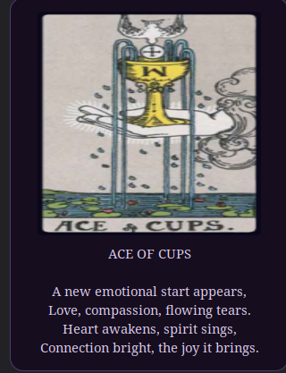

# tarot-vibe
Vibe Tarot
# Tarot Card Desklet 🔮

[](LICENSE)
[]()

A magical one-card tarot pull for the Linux Cinnamon desktop.  
Draw a card, read its poetic interpretation, and discover your fate.

---

## Screenshots

- **Sample Drawn Card**  


---

## Features

- Full 78-card tarot deck (Major & Minor Arcana)  
- One-card random draw with original poetic interpretations  
- Visual card display with a card-back image  
- Ambient sounds: shuffle and flip  
- Lightweight and responsive Cinnamon desklet  

---

## Installation

1. **Clone the repository**  

```bash
git clone https://github.com/YOUR_USERNAME/tarot-desklet.git

## Copy to Cinnamon desklets folder

cp -r tarot-desklet ~/.local/share/cinnamon/desklets/tarot@vibe


## Enable in Cinnamon

Go to Cinnamon Settings → Desklets, find Tarot Card Desklet, and click Add.

## Usage

Click anywhere on the desklet to draw a random card.
The card’s title and poem will appear, and shuffle/flip sounds play automatically.

## File Structure
tarot@vibe/
├── desklet.js       # Main desklet code
├── metadata.json    # Cinnamon desklet metadata
├── images/          # 78 tarot card images + card back
├── sounds/          # shuffle.wav and flip.wav
├── README.md
└── LICENSE

## Requirements

Linux with Cinnamon desktop environment

paplay command (PulseAudio) for sounds

## Contributing

Pull requests are welcome

Submit new card interpretations or improve UI/UX

Maintain proper image naming conventions (e.g., 01_the_fool.png)

## Credits

Tarot card interpretations and poetry: porquenelosdos and Gemini/GPT

Developed for the Cinnamon desktop environment

## License

This project is licensed under the MIT License – see LICENSE for details.
